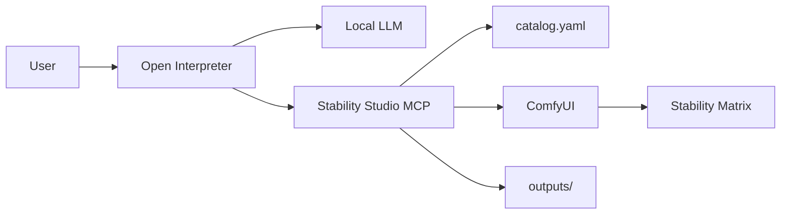

# Stability Studio MCP × Open Interpreter

**Handoff document — June 9, 2026 (updated)**

Reference integration: **Open Interpreter** + **local LLM (LM Studio / Ollama)** + **Stability Studio MCP** → **ComfyUI** (headless, via Stability Matrix).

**Project root:** `<PROJECT_ROOT>/` (clone or copy this repo anywhere)

### Path placeholders

| Placeholder | Meaning |
|-------------|---------|
| `<PROJECT_ROOT>` | Root of this repo (`studio-agent/`) |
| `<STABILITY_MATRIX_ROOT>` | Stability Matrix data directory |
| `<OI_CONFIG_DIR>` | Open Interpreter config dir (`codex-home` under the app's Roaming data folder) |
| `<COMFYUI_URL>` | Default `http://127.0.0.1:8188` |
| `<LM_STUDIO_URL>` | Default `http://127.0.0.1:1234/v1` |

---

## Summary

| Component | Role |
|-----------|------|
| Open Interpreter | Chat UI, tool calling, file workflow |
| Local LLM server | Tool-capable model (LM Studio, Ollama, etc.) |
| Stability Studio MCP | Style routing, workflow build/convert, ComfyUI API |
| ComfyUI | Headless generation (`<COMFYUI_URL>`) |
| Stability Matrix | Models, workflows, package manager |

The MCP server maps plain-language styles (`anime`, `juggernaut`, `photorealistic`, …) to local checkpoints, builds SDXL txt2img workflows, or loads saved Wan T2V/I2V workflow JSON from Stability Matrix, queues on ComfyUI, and saves outputs to `<PROJECT_ROOT>/stability-studio-mcp/outputs/`.

### Status (June 9, 2026)

| Feature | Status |
|---------|--------|
| Image generation (`generate_image`) | **Working** — WAI Illustrious / catalog styles via ComfyUI |
| MCP registration in OI | **Working** — `stability-studio` reaches `ready` |
| Video `t2v` (Wan 2.1) | **Working** — needs `umt5-xxl-enc-bf16`, `wan2.1_t2v_1.3B`, `VHS_USE_IMAGEIO_FFMPEG=1` (§6) |
| Video **`i2v_5b`** (default I2V) | **Working** — Wan 2.2 TI2V-5B native; `image_path` required; ~2–6 min @ 704×1024 on 16 GB |
| Video `i2v` (14B legacy) | **Working but not recommended** — dual 14B + blockswap; use explicit `workflow_id=i2v` only |
| Local model + `interpreter-app` | **Unsupported** — use `stability-studio__*` tools directly (see skill below) |

---

## Architecture



---

## Setup

### 1. Install Python dependencies

```powershell
cd <PROJECT_ROOT>/stability-studio-mcp
pip install -r requirements.txt
```

### 2. Configure machine paths

Edit `<PROJECT_ROOT>/stability-studio-mcp/config.yaml`:

- `stability_matrix.root` → `<STABILITY_MATRIX_ROOT>`
- `stability_matrix.models`, `workflows` → under that root
- `comfyui.url` → `<COMFYUI_URL>`
- `comfyui.package_dir` → ComfyUI package inside Stability Matrix (for custom-node installs)

### 3. Open Interpreter MCP config

Append the block from `<PROJECT_ROOT>/config-examples/open-interpreter-mcp.toml` to `<OI_CONFIG_DIR>/config.toml`. Replace `<PROJECT_ROOT>` in the `args` path with your actual install path.

**Restart Open Interpreter** after any `config.toml` change.

### 4. Local-model skill (recommended)

Copy `config-examples/stability-studio-skill.md` →  
`<OI_CONFIG_DIR>/skills/stability-studio/SKILL.md`

Prevents the agent from calling `interpreter-app` (hosted-only) when using a local LLM.

### 5. Runtime

- Launch **ComfyUI** from Stability Matrix before `generate_image` / `generate_video`
- Local LLM server running with a tool-capable model (vision optional for image understanding)
- For I2V: run **`check_wan_assets(workflow_id="i2v_5b")`** once; download missing files with **`download_wan_assets(workflow_id="i2v_5b", include_large=true)`**

### 6. ComfyUI ffmpeg for video output (Video Helper Suite)

Wan T2V/I2V workflows end in `VHS_VideoCombine`, which pipes frames to **ffmpeg** for MP4 encoding. On Windows, a system ffmpeg on `PATH` (e.g. from WinGet) is often picked instead of the bundled binary and can fail with `[Errno 22] Invalid argument` on stdin — even when Wan sampling and decode succeed.

**Install** `imageio-ffmpeg` into the **ComfyUI package venv** (not the MCP venv):

```powershell
<STABILITY_MATRIX_ROOT>/Data/Packages/ComfyUI/venv/Scripts/pip install imageio-ffmpeg
```

**Force Video Helper Suite to use it** — set **before** starting ComfyUI (Stability Matrix does not set this by default):

```powershell
$env:VHS_USE_IMAGEIO_FFMPEG = "1"
# Then launch ComfyUI from Stability Matrix, or restart ComfyUI if already running
```

Alternative (explicit path, no env var):

```powershell
$env:VHS_FORCE_FFMPEG_PATH = "<COMFYUI_VENV>/Lib/site-packages/imageio_ffmpeg/binaries/ffmpeg-win-x86_64-v7.1.exe"
```

Replace `<COMFYUI_VENV>` with `<STABILITY_MATRIX_ROOT>/Data/Packages/ComfyUI/venv`. The binary filename may differ by `imageio-ffmpeg` version — locate it with:

```powershell
<STABILITY_MATRIX_ROOT>/Data/Packages/ComfyUI/venv/Scripts/python.exe -c "from imageio_ffmpeg import get_ffmpeg_exe; print(get_ffmpeg_exe())"
```

**Verify after restart:** run `generate_video(mode="i2v", image_path="...", ...)`. Wan nodes should execute; `VHS_VideoCombine` should write MP4 under ComfyUI `output/` (MCP copies to `stability-studio-mcp/outputs/`).

**Persistent env (recommended):** set `VHS_USE_IMAGEIO_FFMPEG=1` before ComfyUI starts. Options:

1. **Stability Matrix** — Settings → **Environment** / **Package Environment** → **Environment Variables** → Edit → add `VHS_USE_IMAGEIO_FFMPEG` = `1` → restart ComfyUI.
2. **Windows** — User environment variables (same name/value) → quit and relaunch Stability Matrix, then ComfyUI.
3. **Session-only** — `$env:VHS_USE_IMAGEIO_FFMPEG = "1"` in PowerShell, then start Stability Matrix from that shell.

---

## MCP tools

| Tool | Purpose |
|------|---------|
| `get_generation_context` | Styles, checkpoints, LoRAs, workflows, **`hardware_profile`**, **`generation_limits`**, `wan_video_assets`, backend URLs |
| `list_styles` | Style presets and aliases |
| `list_checkpoints` / `list_loras` | Disk scan |
| `list_video_workflows` | Short workflow ids (`t2v`, `i2v_5b`, `i2v`, …) |
| `check_backends` | ComfyUI / InvokeAI reachability |
| `check_wan_assets` | Installed vs missing Wan models/LoRAs per workflow |
| `download_wan_assets` | Download missing Wan assets from Hugging Face |
| `scan_models` | Heuristic style → checkpoint suggestions |
| `check_comfyui_dependencies` | Missing custom nodes for a video workflow |
| `install_comfyui_dependencies` | Git-clone known node packs into ComfyUI |
| `generate_image` | T2I via style preset |
| `generate_video` | T2V / I2V via saved workflow JSON; **`image_path` required for I2V** |

In Open Interpreter, tools appear as `stability-studio__<tool_name>`.

### Example flows

**Image:**
```
stability-studio__get_generation_context
→ stability-studio__generate_image(prompt="...", style="anime")
→ { checkpoint, style, saved_files: ["<PROJECT_ROOT>/stability-studio-mcp/outputs/....png"] }
```

**Video I2V (recommended — default `i2v_5b`):**
```
stability-studio__get_generation_context
→ stability-studio__check_backends
→ stability-studio__check_wan_assets(workflow_id="i2v_5b")
→ stability-studio__download_wan_assets(workflow_id="i2v_5b", include_large=true)   # first time only
→ stability-studio__generate_video(
     mode="i2v",
     image_path="D:/path/to/source.png",
     prompt="...",
     style="anime",
     num_frames=65,
     frame_rate=16
   )
```

Omit `workflow_id` for I2V — the server defaults to **`i2v_5b`**. Resolution is aspect-matched to the source image within GPU caps (see `generation_limits.video_i2v`).

**Video T2V:**
```
stability-studio__get_generation_context   # check wan_umt5_ready
→ stability-studio__check_backends
→ stability-studio__check_comfyui_dependencies(workflow_id="t2v")
→ stability-studio__generate_video(prompt="...", mode="t2v", workflow_id="t2v")
```

### Wan asset requirements

#### `i2v_5b` (default I2V — native ComfyUI Wan 2.2 TI2V-5B)

| Asset | Location | Notes |
|-------|----------|-------|
| `wan2.2_ti2v_5B_fp16.safetensors` | `Models/DiffusionModels/` | ~10 GB — `download_wan_assets(..., include_large=true)` |
| `wan2.2_vae.safetensors` | `Models/VAE/` | Same VAE for latent encode (`Wan22ImageToVideoLatent`) and decode (`VAEDecode`) |
| `umt5_xxl_fp8_e4m3fn_scaled.safetensors` | `Models/TextEncoders/` | **Required** for native `CLIPLoader` — **`umt5-xxl-enc-bf16` does not work** here |

Workflow file (Stability Matrix): `workflow-wan22-ti2v-5b-i2v-comfyui-native.json`

#### `t2v` (Wan 2.1 T2V)

| Asset | Location | Notes |
|-------|----------|-------|
| `umt5-xxl-enc-bf16.safetensors` | `Models/TextEncoders/` | WanVideo custom-node path |
| `wan2.1_t2v_1.3B_*.safetensors` | `Models/DiffusionModels/` | Must be a **t2v** checkpoint, not i2v |
| `wan_2.1_vae.safetensors` | `Models/VAE/` | Paired with Wan 2.1 workflows |
| `imageio-ffmpeg` (Python package) | ComfyUI package venv | Required for `VHS_VideoCombine` MP4 mux; see §6 |

### Video workflow ids

| `workflow_id` | Mode | Notes |
|---------------|------|-------|
| *(empty)* + `mode=i2v` | image-to-video | **Default:** `i2v_5b` |
| `i2v_5b` | image-to-video | Wan 2.2 TI2V-5B native — fast, clean prompts, ≤16 GB friendly |
| `t2v` | text-to-video | Wan 2.1 1.3B — **simplest T2V**, fewest missing nodes |
| `t2v_wan22` | text-to-video | Needs `comfyui-various` (JWInteger) |
| `i2v` | image-to-video | Wan 2.2 **14B dual-model** — explicit only; ~15–20 min, VRAM-heavy |
| `i2v_wan21` | image-to-video | Wan 2.1 low-VRAM I2V / VACE |
| `i2v_gpu` | image-to-video | Wan 2.1 14B builder — 24 GB+ recommended |

Pass short ids only — **not** the full `.json` filename. Server resolves filenames as fallback.

### I2V quality settings (automatic for `i2v_5b`)

The engine applies these when using the native 5B workflow:

| Setting | Value | Notes |
|---------|-------|-------|
| Resolution | Aspect-fit to source within `generation_limits` | e.g. 832×1216 source → 704×1024 on 16 GB |
| VAE | `wan2.2_vae.safetensors` | Enforced in workflow + converter remap |
| KSampler | 40 steps, CFG 5.5 | Up from workflow default 30 / 5 |
| MP4 CRF | 17 | Less compression than default 19 |

Call **`get_generation_context`** and stay within **`generation_limits`** unless the user explicitly asks for more.

---

## Changes log

### June 9, 2026 — initial integration

1. **Style catalog** — 15 presets; `default_content_rating: open`.
2. **Video workflow resolution** — `catalog.py` accepts catalog ids or filenames.
3. **UI → API workflow converter** — rgthree strip, GetNode/SetNode inline, `object_info` widget mapping, invalid COMBO skip.
4. **ComfyUI dependencies** — `check_comfyui_dependencies`, `install_comfyui_dependencies`.
5. **T5 encoder remap** — `_remap_wan_t5_encoder()` forces umt5-xxl; family-aware matching avoids qwen false positives.
6. **`get_generation_context`** — exposes `wan_umt5_ready`, `wan_umt5_download`.
7. **OI integration** — MCP block, `stability-studio` skill, config examples.

### June 9, 2026 — Wan video model remapper

**Bug:** `_pick_combo_value()` matched the first installed `wan2.1*` file. When ComfyUI listed `wan2.1_i2v_*` before `wan2.1_t2v_*`, the `t2v` workflow loaded an I2V 14B model. `WanVideoSampler` then failed:

```
expected input … to have 36 channels, but got 16 channels
```

**Fix in `workflow_converter.py`:** mode-aware (`t2v` / `i2v` / `ti2v`) + size-aware Wan model picking; `_remap_wan_video_model()` validates loader picks.

### June 9, 2026 — VHS ffmpeg / MP4 mux (environment)

**Symptom:** Wan pipeline completes; failure on `VHS_VideoCombine` with `OSError: [Errno 22] Invalid argument`.

**Fix:** `imageio-ffmpeg` in ComfyUI venv + `VHS_USE_IMAGEIO_FFMPEG=1` before ComfyUI start (see §6).

### June 9, 2026 — `i2v_5b` default I2V path

- New catalog workflow **`i2v_5b`** → native ComfyUI Wan 2.2 TI2V-5B graph (`workflow-wan22-ti2v-5b-i2v-comfyui-native.json`).
- **`generate_video`** supports **`image_path`** for I2V; default workflow is `i2v_5b` on all VRAM tiers.
- **`check_wan_assets`** / **`download_wan_assets`** for model manifest (incl. ~10 GB diffusion + ~6 GB umt5 fp8).
- Native **`CLIPLoader`** requires **`umt5_xxl_fp8_e4m3fn_scaled.safetensors`** — not the Kijai encoder-only `umt5-xxl-enc-bf16` used by WanVideo nodes.
- **`_remap_wan_vae_loader()`** forces **`wan2.2_vae.safetensors`** for decode/encode pairing.
- **Quality injection:** aspect-fit resolution, 40 steps, CRF 17, VAE enforcement.
- Legacy **`i2v`** (14B dual) kept for explicit override only.

### June 11, 2026 — T2V + bow I2V validation (16 GB)

- T2V `t2v`: 17 → 81 frames ramp OK; avoid parallel video jobs when GPU shared.
- I2V bow: `i2v_5b` 17–65 frames; PainterI2V 49 frames @ `motion_amplitude=1.1`.
- Logs: `outputs/kitsune_bow_video_test.json`, `outputs/video_quality_setup.json`.

### June 9, 2026 — OI docs / config refresh

- Updated `config-examples/stability-studio-skill.md`, `open-interpreter-mcp.toml` (`tool_timeout_sec=1200`, Wan asset tools).
- This document aligned with validated `i2v_5b` path.

---

## What worked best

Validated stack for a **single chat interface** driving local image and video generation:

| Layer | What worked | Notes |
|-------|-------------|-------|
| **Agent UI** | Open Interpreter + MCP tools | Tools appear as `stability-studio__*`; restart OI after config/code changes |
| **Local LLM** | LM Studio, tool-capable VL model (e.g. Qwen3-VL-4B) | Install `stability-studio` skill so the model does **not** call `interpreter-app` |
| **Image backend** | ComfyUI headless + `catalog.yaml` styles | `get_generation_context` → `generate_image(style="anime")` |
| **Video I2V** | **`i2v_5b`** + `image_path` | ~2–6 min @ 704×1024 on RTX 5060 Ti 16 GB; omit `workflow_id` |
| **Video T2V** | `workflow_id=t2v` | Wan 2.1 1.3B — **81 frames max** @ 16 fps on 16 GB (validated 2026-06-11) |
| **Video bow from still** | `i2v_5b_painter`, `motion_amplitude=1.1` | 49 frames recommended; log: `outputs/kitsune_bow_video_test.json` |
| **Wan I2V models** | `wan2.2_ti2v_5B_fp16` + `wan2.2_vae` | Single 5B TI2V — not 14B dual unless explicit `workflow_id=i2v` |
| **Wan I2V text encoder** | `umt5_xxl_fp8_e4m3fn_scaled.safetensors` | Native `CLIPLoader`; enc-bf16 causes `Cannot copy out of meta tensor` |
| **Wan T2V text encoder** | `umt5-xxl-enc-bf16.safetensors` | WanVideo `LoadWanVideoT5TextEncoder` path |
| **MP4 mux** | `imageio-ffmpeg` in ComfyUI venv + `VHS_USE_IMAGEIO_FFMPEG=1` | System WinGet ffmpeg often fails VHS pipe |
| **MCP converter** | `workflow_converter.py` with `object_info` | Required for video — UI workflow JSON is not API-ready without conversion + remaps |

**Recommended agent flow (images):**
```
stability-studio__get_generation_context
→ stability-studio__generate_image(prompt="...", style="anime")
```

**Recommended agent flow (I2V):**
```
stability-studio__get_generation_context
→ stability-studio__check_backends
→ stability-studio__check_wan_assets(workflow_id="i2v_5b")
→ stability-studio__generate_video(mode="i2v", image_path="...", prompt="...", num_frames=65, frame_rate=16)
```

**Recommended agent flow (T2V):**
```
stability-studio__get_generation_context
→ stability-studio__check_backends
→ stability-studio__check_comfyui_dependencies(workflow_id="t2v")
→ stability-studio__generate_video(prompt="...", workflow_id="t2v", mode="t2v")
```

---

## Troubleshooting

| Symptom | Cause | Fix |
|---------|-------|-----|
| `interpreter-app` not available | Local model tried hosted-only meta-tool | Use `stability-studio__get_generation_context` directly; install skill |
| `unsupported call: interpreter-app` | Same as above | MCP is connected; not a server bug |
| `ComfyUI queue failed (400)` | Bad widget mapping from UI workflow | Restart OI after MCP update |
| **`Cannot copy out of meta tensor`** on `CLIPTextEncode` | `umt5-xxl-enc-bf16` used with native `CLIPLoader` | Install **`umt5_xxl_fp8_e4m3fn_scaled`**; restart ComfyUI |
| **`36 channels, but got 16`** on `WanVideoSampler` | T2V workflow loaded **i2v** checkpoint | Fixed Wan model remapper; ensure `wan2.1_t2v_*` is installed |
| **`VHS_VideoCombine`** / `[Errno 22] Invalid argument` | System ffmpeg pipe failure | `pip install imageio-ffmpeg` in **ComfyUI venv**; set `VHS_USE_IMAGEIO_FFMPEG=1`; restart ComfyUI (§6) |
| MP4 missing but first-frame PNG exists | Same ffmpeg mux failure | Same as above |
| Soft/blurry I2V | Source downscaled (e.g. 480×832 vs 832×1216 input) | Check `generation_limits`; engine now aspect-fits to source |
| OI tool timeout during I2V | Default 600s too low for high-res I2V | Set `tool_timeout_sec = 1200` in OI MCP config |
| Agent passes `.json` filename as `workflow_id` | Model confusion | Use `i2v_5b`, `t2v`, `i2v` short ids |
| Stale MCP after code update | OI caches MCP subprocess at startup | Full restart of Open Interpreter |
| Wrong I2V workflow (14B, instant finish) | Stale MCP or explicit `workflow_id=i2v` | Reload MCP; omit `workflow_id` for default `i2v_5b` |
| `TextCombinerTwo` not found | Missing ComfyUI_Mira | Only on legacy `i2v` 14B workflow — use `i2v_5b` instead |

---

## Project structure

```
<PROJECT_ROOT>/
  README.md
  AGENTS.md
  CURSOR-INTEGRATION.md
  OPEN-INTERPRETER-INTEGRATION.md     ← this file
  HARDWARE.md
  WAN-ASSETS.md
  LICENSE
  .gitignore
  .cursor/
    mcp.json
    rules/stability-studio-mcp.mdc
  install.ps1
  setup-cursor.ps1
  setup-open-interpreter.ps1
  config-examples/
    open-interpreter-mcp.toml         ← full OI MCP block
    stability-studio-skill.md         ← copy to OI skills/
    cursor-mcp.json
  stability-studio-mcp/
    server.py
    config.yaml                       ← machine paths (gitignored)
    config.yaml.example
    catalog.yaml
    requirements.txt
    outputs/
    studio/
      engine.py
      catalog.py
      comfy_client.py
      workflow_builder.py
      workflow_converter.py
      hardware_profile.py
      wan_assets.py
      comfy_deps.py
      ...
```

---

## Key implementation notes

### `workflow_converter.py`

Critical path for video. Always pass `object_info` from `GET /object_info` when converting.

- **`remap_api_inputs_to_installed()`** — snaps COMBO widgets to installed files.
- **`_remap_wan_t5_encoder()`** — umt5-xxl for `LoadWanVideoT5TextEncoder` (WanVideo graphs).
- **`_remap_wan_clip_loader()`** — **`umt5_xxl_fp8`** for native `CLIPLoader` (i2v_5b).
- **`_remap_wan_vae_loader()`** — **`wan2.2_vae`** for native TI2V graphs.
- **`_remap_wan_video_model()`** — t2v/i2v/ti2v-aware pick for loaders.

### `catalog.yaml`

Authoritative mapping for styles and video workflows. `get_generation_context()` exposes `style_to_checkpoint` — agents should trust this over raw disk guesses.

### `config.yaml`

Machine-specific paths only. No secrets. Adjust per install.

---

## Feedback for the Open Interpreter team

1. **Tool results vs narration** — Agents sometimes ignore `checkpoint` / `saved_files` from tool JSON.
2. **Enum tool params** — `workflow_id` would benefit from schema enums (`t2v`, `i2v_5b`, …).
3. **MCP `instructions`** — FastMCP server instructions help when the model reads them at session start.
4. **Local models + `interpreter-app`** — Local profiles get MCP tools as `server__tool` directly; `interpreter-app` fails. Document per provider type.
5. **Approval modes** — `generate_image` / `generate_video` use `prompt` approval for GPU-heavy runs.
6. **Restart required** — `[mcp_servers.*]` changes need full app restart.
7. **Tool timeout** — Video generation can exceed 600s; document `tool_timeout_sec` for I2V.

---

## Cursor (optional)

Same MCP server works in Cursor via `config-examples/cursor-mcp.json`. Replace `<PROJECT_ROOT>` in the path.

---

## Wan2GP hero video (Open Interpreter)

Before `generate_video_hero`:

1. `stability-studio__check_gpu_backend` — ComfyUI must be stopped on 16 GB
2. `stability-studio__check_wan2gp_runtime`
3. `stability-studio__generate_video_hero` with `image_path`, `video_length=49`, `resolution="832x480"`

Never run ComfyUI `generate_video` and Wan2GP hero in parallel on ≤16 GB VRAM.

## Storyboard CLI (local scripts)

For multi-beat hero sequences (Wan2GP + MOSS + ffmpeg splice), use the unified module **`studio/storyboard_cli.py`** and CLI:

```powershell
cd stability-studio-mcp
python scripts/storyboard/generate_storyboard.py plan --script "walk | Hello." --title demo
python scripts/storyboard/generate_storyboard.py check --project-dir "D:/path/to/project"
python scripts/storyboard/generate_storyboard.py splice --skip-missing
```

- Set `outputs.delivery` in `config.yaml` to omit `--project-dir`.
- Manifest: `<project>/logs/storyboard_manifest.json` — central success criteria per sequence.
- MCP equivalents: `plan_storyboard_scene`, `check_storyboard_readiness`, then `generate_video_hero` / `generate_audio` per beat.
- Legacy Rin runners: `scripts/storyboard/legacy/` (deprecated).

See [STORYBOARD-QUICKSTART.md](STORYBOARD-QUICKSTART.md).

---

## Not integrated

- Wan2GP, SD.Next, or ComfyUI canvas as MCP backends — ComfyUI runs headless only.
- Cloud agents cannot reach local ComfyUI unless the user runs Cursor/OI locally with this MCP server.

---

## Lessons learned

### Architecture

1. **One headless backend (ComfyUI) beats many UIs in the MCP.** Images and Wan video both queue on the same API.
2. **The MCP’s job is translation, not replacement.** Saved Stability Matrix workflow JSON + `catalog.yaml` + converter/remaps bridge agent intent to ComfyUI node graphs.
3. **Local LLMs need explicit tool guidance.** OI injects MCP tools as `stability-studio__*`, but the default system prompt still pushes `interpreter-app`. The `stability-studio` skill is required for LM Studio profiles.

### Workflow conversion (video)

4. **Never trust fuzzy “first match” for Wan files.** Mode- and size-aware remapping is required.
5. **T5/CLIP and diffusion models are separate failure modes.** Native `i2v_5b` uses `CLIPLoader` + fp8 umt5; WanVideo graphs use `LoadWanVideoT5TextEncoder` + enc-bf16.
6. **Always fetch `object_info` before `ui_to_api()`.** Widget order in saved UI workflows does not match ComfyUI’s API schema.
7. **Use short workflow ids (`i2v_5b`, `t2v`), not `.json` filenames.**

### Environment (Windows)

8. **Video can “almost work” — decode succeeds, mux fails.** Set `VHS_USE_IMAGEIO_FFMPEG=1` **before** the ComfyUI process starts.
9. **Restart boundaries matter.** MCP config → restart Open Interpreter. Env vars → restart ComfyUI. Converter code → restart OI.

### Performance and models

10. **Wan 2.2 TI2V-5B (`i2v_5b`) is the right default I2V on 16 GB.** Legacy 14B dual (`i2v`) is slow and VRAM-fragile.
11. **Match encode resolution to source aspect ratio.** Fixed 480×832 caps destroyed quality on 832×1216 portrait sources.
12. **Pair VAE correctly:** `wan2.2_vae` for 5B TI2V encode and decode.

### Process

13. **Validate in layers.** `check_backends` → `check_wan_assets` → queue prompt → read ComfyUI `execution_error` node id.
14. **Handoff docs should be path-agnostic.** Use placeholders in shared docs; keep machine paths only in local `config.yaml`.

### Image editing (June 2026)

15. **Browser “edit this image” ≠ one local tool.** Use the decision tree in [IMAGE-EDITING.md](IMAGE-EDITING.md): i2i for mood, inpaint + IP-Adapter for new objects in a region, ControlNet for composition lock.
16. **`photorealistic` is SD 1.5**, not SDXL — SDXL ControlNet and SDXL IP-Adapter fail with `y is None… SDXL on SD1`. Use `juggernaut` or `photorealistic_pony` for `generate_image_controlnet`.
17. **I2I does not add objects** (flags, signs). Low denoise preserves the subject; raising denoise drifts identity without reliable new props.
18. **IP-Adapter inpaint needs `attn_mask`** and a **small** mask (`right_building`); large `top` masks blur or shift ruins.
19. **ControlNet depth + canny** locks layout from a guide image but resists painting new detail on controlled surfaces — combine with regional inpaint for “add flag, keep knight.”
20. **Restart boundaries:** new ComfyUI custom nodes → restart ComfyUI; new MCP tools → restart OI/Cursor MCP. Launch ComfyUI via Stability Matrix or package `venv`, not bare Assets Python.
21. **Flag prompts:** describe `green white orange vertical tricolor`; negate `orange armor`, `flag on cross`.

22. **Use `edit_image` not raw inpaint** — pass `food_group` (anime|fantasy|cyberpunk|photoreal); read `verification.manual_checks` in the result.
23. **`setup_image_editing()`** replaces separate IP-Adapter + ControlNet setup for new machines (~12 GB).
24. **Food groups:** anime→ilustmix, fantasy→divine_elegance, cyberpunk→cyberpunk, photoreal→photorealistic_pony.

Full playbook: **[IMAGE-EDITING.md](IMAGE-EDITING.md)**.

---

*Zip `<PROJECT_ROOT>/` for the complete codebase. Configure `config.yaml` and OI MCP paths on each machine.*
